# Frontend Progress - LeoPlaner

### Figma File
Link: https://www.figma.com/design/683xuXzLKWuxzxvmS1lVgG/Untitled?node-id=0-1&t=0fLzpHeKQrqmoSKr-1

---

### In Work

- Feedback round on the redesigned UI
---

### Screenshots (2026-09-21, mock data)

| Page | Light | Dark / variant |
| --- | --- | --- |
| Landing | 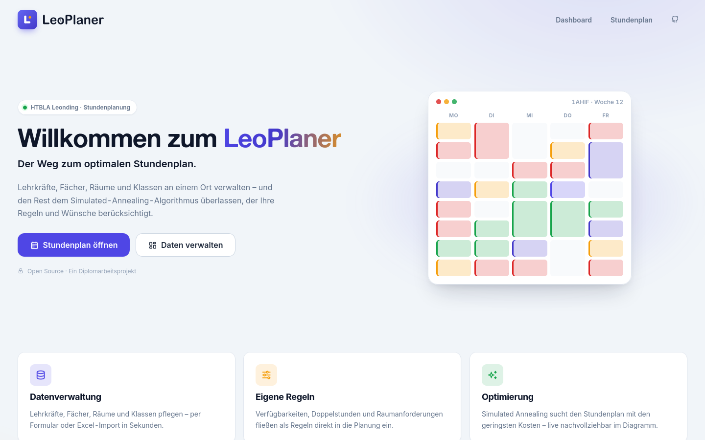 | |
| Dashboard | 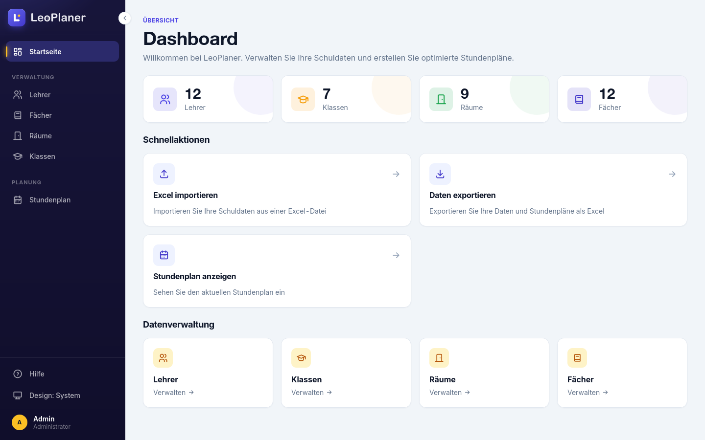 | |
| Lehrer | 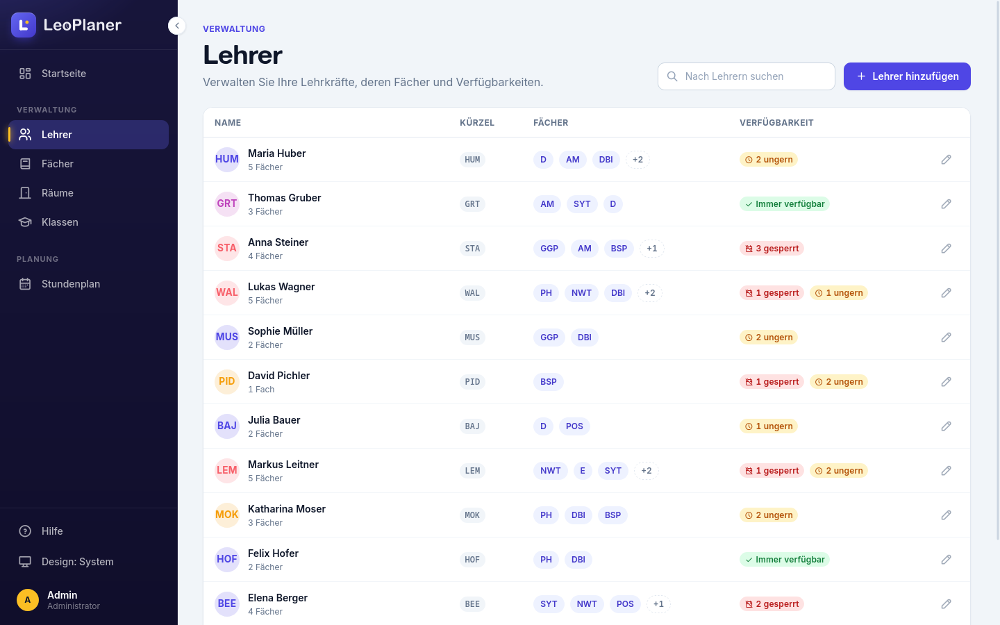 | 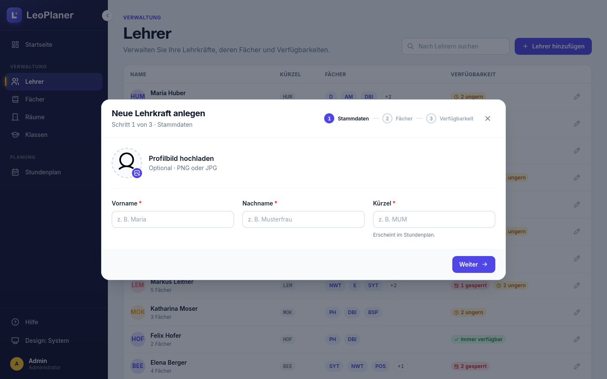 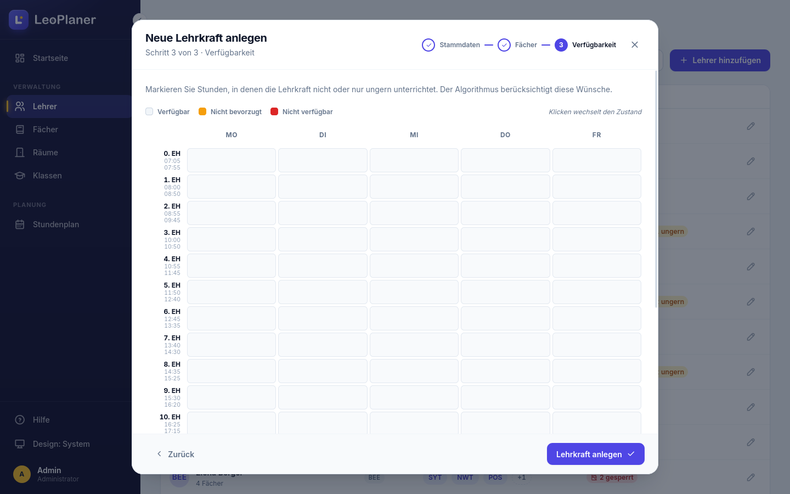 |
| Fächer | 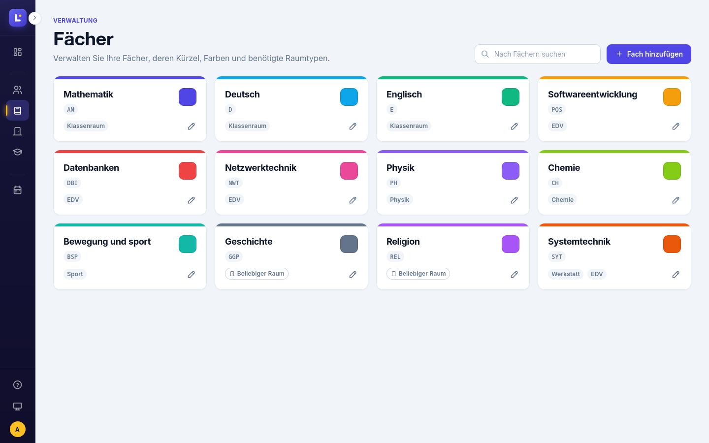 | |
| Räume | 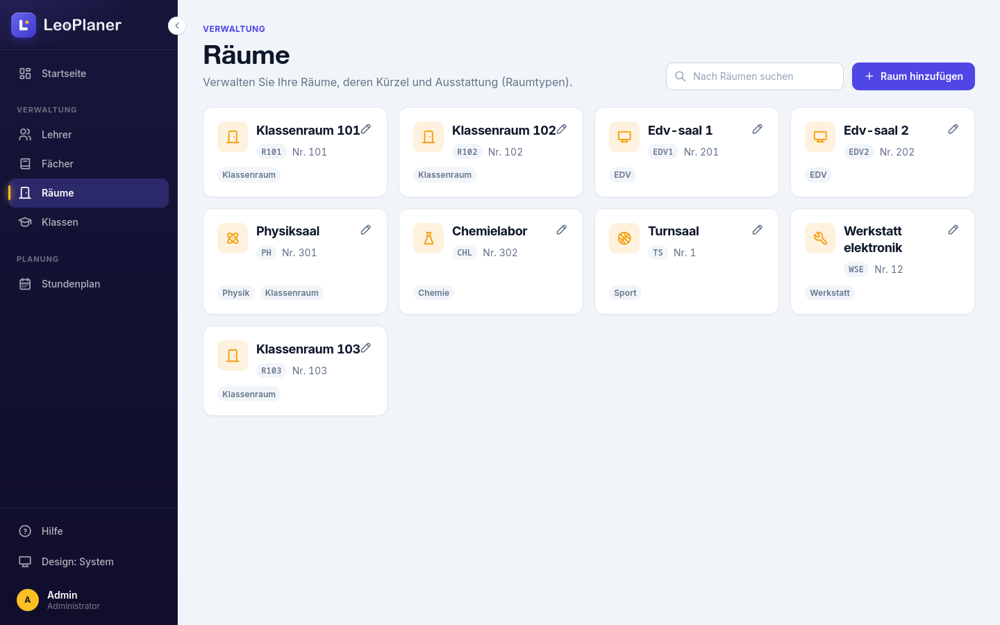 | |
| Klassen | 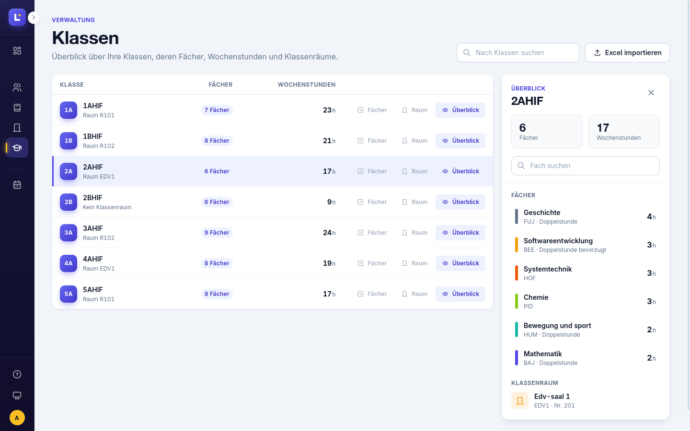 | |
| Stundenplan | 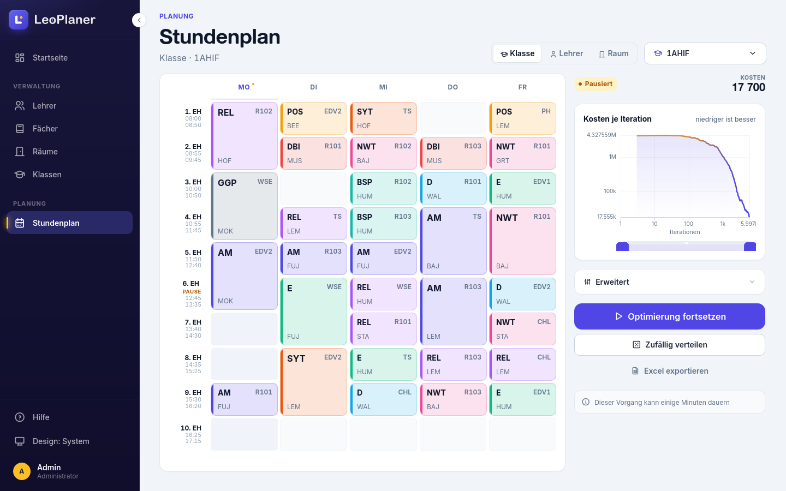 | 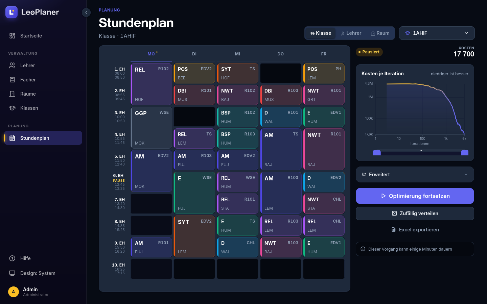 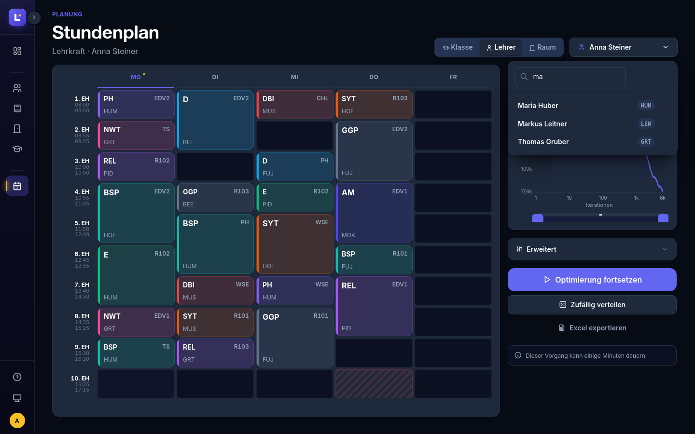 |
| Tablet drawer | 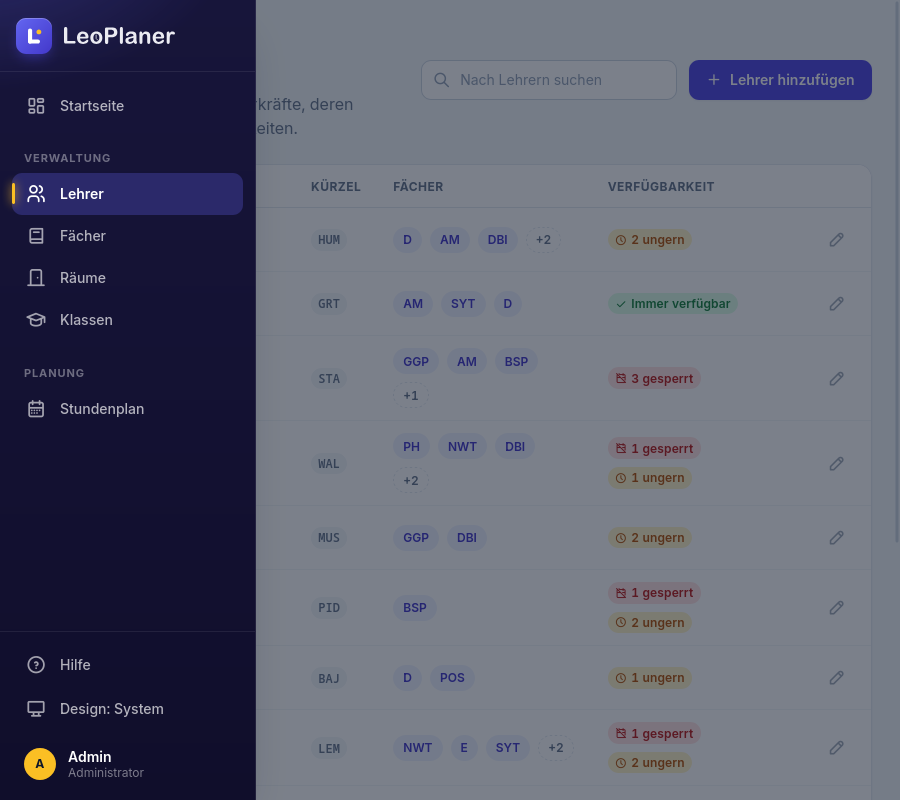 | |

## Change log

### 20.02.2026
- Created markdown file
- Tried making different variants

### 23.02.2026
- Experimenting with new designs
- Teacher Page Availability Rework

### 24.02.2026
- Reworked Timetable Page
- Tried new designs

### 28.02.2026
- Started creating the chart designs

### 02.04.2026
- Research for design improvement

### 04.04.2026
- New navbar design
- Improvised Logo
- Reworked design slightly

### 05.04.2026
- Implemented design into the other pages
- Worked on new timetable design

### 11.04.2026
- Reworked design slightly

### 12.04.2026
- Working on timetable design

### 13.04.2026
- Reworked timetable design

### 08.05.2026
- Created class subpage
- Created Simple/Advanced time table design

### 09.05.2026
- Reworked class subpage

### 10.05.2026
- Created new variants

### 11.05.2026
- Started implementing feedback
- Reworking class subpage
- Trying out class subpage designs
- Finished second class subpage version
- Made some logo variants
- Organized Figma

### 21.09.2026
- Full UI redesign (OpenSpec change `redesign-ui`): token-based design system
  (`web/style/tokens.css`) with light + dark theme, new app shell with
  collapsible dark sidebar and mobile drawer, shared components
  (buttons, inputs, tables, cards, modal, toast, skeleton, empty states)
- All data pages moved to one page template; Lehrer/Klassen as tables,
  Fächer/Räume as card grids; Klassen got an overview side panel
- Stundenplan rebuilt as a workbench: CSS-grid canvas with `grid-row: span`
  lesson cards, view switcher (Klasse/Lehrer/Raum) with searchable picker,
  optimizer rail with live theme-aware cost chart and status chip
- Landing page rebuilt with hero + CSS-only timetable mosaic
- Icons consolidated on Tabler; FontAwesome kit and `essentials.css` removed
